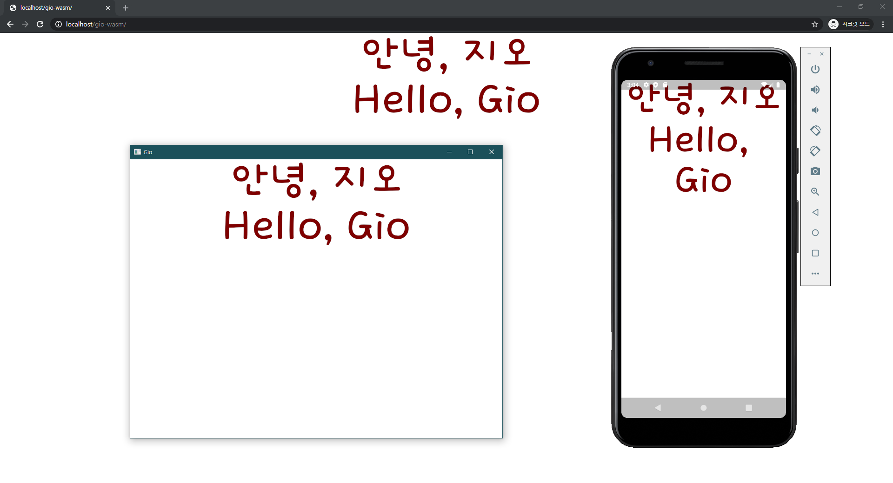

# Go 1.16 file embeding practice for Gio



## `/server`
* Webserver for `hello-wasm`, `hello-gio`

## `/hello-wasm`
```js
// s from files/hello.txt
console.log("Hello, " + s + "!")
```
```sh
# set GOOS="js" GOARCH="wasm" then build
cd hello-wasm
go build -o ../hello.wasm
```

## `/hello-gio`
### Linux
```bash
cd hello-gio
go build
./hello-gio
```

### Windows
```powershell
cd hello-gio
go build -ldflags "-H windowsgui" -o ../hello-gio.exe

cd ..
./hello-gio
```

### wasm
```sh
# gogio : go get gioui.org/cmd/gogio (See https://gioui.org)
cd hello-gio
../bin/gogio -target js -o ../gio-wasm .
```

### android
```sh
# gogio : go get gioui.org/cmd/gogio (See https://gioui.org)
cd hello-gio
../bin/gogio -target android -o ../hello-gio.apk .
```
